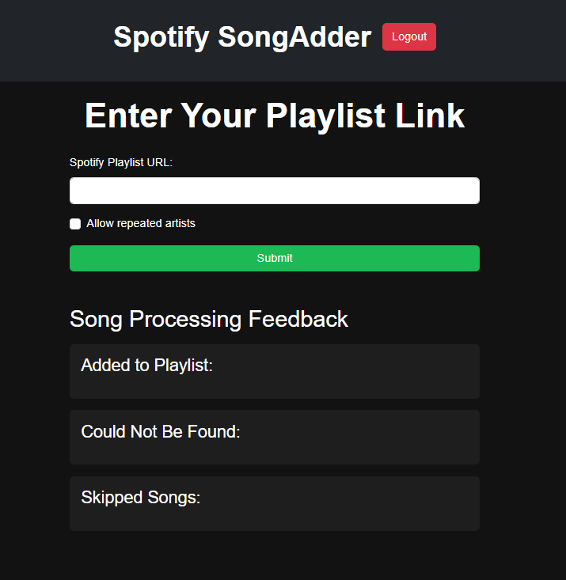
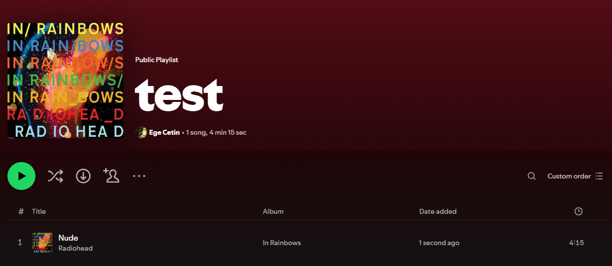
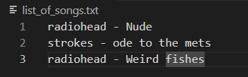
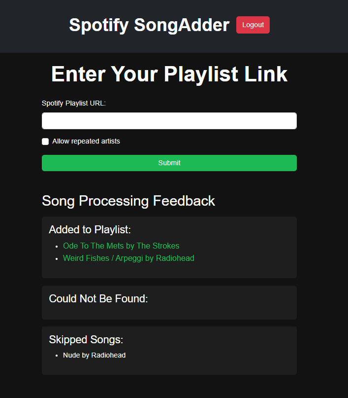

# Spotify SongAdder

A simple web app for managing and adding songs to your Spotify playlists.

## Table of Contents
- [Introduction](#introduction)
- [Purpose](#purpose)
- [Setup Instructions](#setup-instructions)
  - [Prerequisites](#prerequisites)
  - [Clone the Repository](#1-clone-the-repository)
  - [Create and Activate a Virtual Environment](#2-create-and-activate-a-virtual-environment)
  - [Install Dependencies](#3-install-dependencies)
  - [Set Up Spotify API Credentials](#4-set-up-spotify-api-credentials)
  - [Configure Environment Variables](#5-configure-environment-variables)
  - [Run the Application](#6-run-the-application)
- [Usage](#usage)

## Introduction
Spotify SongAdder allows users to authenticate with Spotify and add songs to their playlists with ease. The app allows you to process playlists by entering the playlist link, adding tracks, and viewing feedback on added, skipped, or missing tracks.

Here's the UI: 



I created a test playlist for this demonstration.



And here's the `.txt` file that you need to enter the song 



Here's how it looks after we add the songs.




## Purpose
The reason I started this project was because I was watching the man, the myth, the legend `Sebastian Lague`, and I found myself really enjoying the background music in his videos. I was always into editing, so I liked saving songs to use in the background and his video descriptions usually included a list of the songs he used. Since his videos were usually quite long, that meant there were a lot of songs and of course he would use some of the same songs in his other videos. That's why I decided to automate this process of copying a song title from his description and adding it to my Spotify playlist one by one. I did NOT want to spend hours torturing myself by doing all of that manual task, so instead, I tortured myself for hours making this app instead. 

I was done in about a day or two, and I was fairly happy with the project because it solved a problem I had. But it actually turned out to solve one of my friend's problem too. He was getting song recommendations from everyone and he created this Spotify playlist where he would add one song (which later became 5) a day for a year. However, he wanted there to be no repeat of artists. So that's why my program currently has a "allow for repeated artists" button. Fun story I suppose.

This is also the project that made me learn the value of environmental variables. I'd like to think every developer at some point accidently pushed their API key to GitHub so to avoid that I created environmental variables and stored my secrets there.

## How It's Made
- Used Technologies: 
  - Python – Core language for application logic
  - Flask – Web framework for routing, sessions, and rendering templates
  - Spotipy – Spotify Web API wrapper for authentication and playlist operations
  - HTML – Rendered by Flask for forms and feedback pages
  - Spotify Web API – Handles track search, playlist modification, authentication
  - FlaskSessionCacheHandler – Manages Spotify OAuth tokens via Flask sessions

- There's a cache handler to store the OAuth access token in the Flask session, so users don’t have to log in repeatedly. Checks whether the user is authenticated by validating the cached token stored in the Flask session.
- If the token is not valid, the app generates an authorisation URL where the user can log in and grant permissions. If the user is authenticated, the app renders an HTML form where the user can enter a Spotify playlist URL. If an error message exists, it’s displayed in a red box.
- Extracts the playlist URL from the form submission. Calls a helper function to extract the playlist ID from the URL. If the playlist ID is invalid, the user is redirected back to the homepage with an error message.
- Opens the file list_of_songs.txt in read mode. This file is expected to contain a list of song names (one per line). 
  - Encodes the string into windows-1252 (a character encoding), and then decodes it back into utf-8. This step helps ensure compatibility with special characters or encoding issues that might arise when reading the file. For example if the song has a `'` symbol it can cause problems.
- Uses the Spotipy search() method to search Spotify for tracks that match the query. The q=query parameter specifies the search term (the song name), type='track' restricts the search to tracks only, and limit=1 ensures only one result is returned (the most relevant one).
  - Checks if any tracks were returned from the search (search_results['tracks']['items']). If the list is not empty, it means the track was found on Spotify. Then extracts every needed info like name and url, also checks if track is already in the playlist.

## Future Implementations
- Rather than a file, accept text book from website
- Remove "allow repeated artists" button


## Setup Instructions

Follow these steps to set up the project on your local machine:

### Prerequisites

Make sure you have the following installed:
- Python 3.x (preferably Python 3.7+)
- Git (to clone the repository)
- Spotify Developer Account (for creating a Spotify API application and obtaining credentials)

### 1. Clone the Repository

Open your terminal and clone the project repository:

```bash
git clone https://github.com/Chetoh16/SongAdder
```

### 2. Create and Activate a Virtual Environment

Navigate to the project directory and create a virtual environment:

```bash
cd spotify-songadder
python -m venv venv
```

#### Activate the virtual environment:

Windows:
```bash
venv\Scripts\activate
```

macOS/Linux:
```bash
source venv/bin/activate
```
### 3. Install Dependencies

Once the virtual environment is activated, install the required dependencies from requirements.txt:

```bash
pip install -r requirements.txt
```

### 4. Set Up Spotify API Credentials

To use the Spotify API, you need to create an app on the Spotify Developer Dashboard.

1. Go to the Spotify Developer Dashboard and log in with your Spotify account.
2. Create a new app.
3. Note down the Client ID, Client Secret, and Redirect URI (you will need to set this URI in your app as well).

### 5. Configure Environment Variables

Create a .env file in the root directory of the project. This file will store sensitive information such as your Spotify API credentials. Add the following contents to the .env file:

```bash
client_id=your_client_id
client_secret=your_client_secret
```
Replace your_client_id and your_client_secret with your actual credentials.

### 6. Run the Application

After setting up everything, run the Flask application:

```bash
python song_adder.py
```
This should start the server locally at http://localhost:5000. Open this URL in your browser to use the app.

### Usage
1. **Log In**: When you visit the homepage, you'll be prompted to log in to your Spotify account.
2. **Add Songs**: After logging in, you can paste your Spotify playlist URL to add songs to the playlist.
3. **Error Handling**: If the playlist link is invalid, an error message will appear.
4. **Song Processing Feedback**: Once songs are processed, you'll see feedback showing which songs were added, skipped, or couldn't be found.
